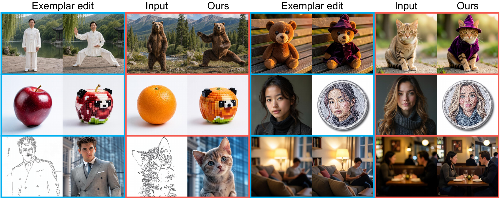
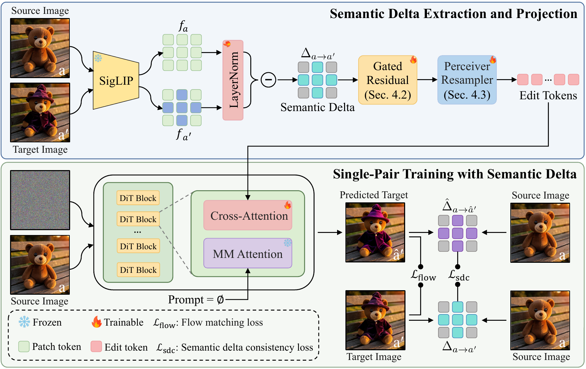

# Delta-Adapter: Scalable Exemplar-Based Image Editing with Single-Pair Supervision

<p align="center">
  <a href="https://delta-adapter.github.io/">
    
  </a>
  <a href="#">
    
  </a>
  <a href="#">
    
  </a>
</p>

<p align="center">
  
</p>

## Overview

Delta-Adapter is a framework for exemplar-based image editing from a single source-target image pair, without textual guidance. Given an exemplar pair that demonstrates a visual transformation, Delta-Adapter learns the underlying edit semantics and applies the same transformation to a new query image.

Existing exemplar-based editing methods often rely on pair-of-pairs supervision, where two image pairs with the same edit semantics are required for training. Delta-Adapter removes this requirement by representing the exemplar transformation as a semantic delta rather than directly conditioning on the target image. This enables scalable single-pair supervision and supports test-time adaptation on challenging unseen edits.

## Highlights

- Learns exemplar-based image editing from a single source-target pair.
- Requires no text instruction during training or inference.
- Extracts a normalized semantic delta from dense vision features.
- Injects edit tokens into a frozen DiT-based editing backbone through a Perceiver-based adapter.
- Supports continuous editing by adjusting adapter strength.
- Enables efficient test-time adaptation using only the provided exemplar pair.

## Method

<p align="center">
  
</p>

## Repository Status

This repository is under preparation. We plan to release:

- Inference code
- Model checkpoints
- Training scripts
- Evaluation scripts
- Example assets and demo instructions

## Citation

```bibtex
@misc{chen2026deltaadapter,
  title={Delta-Adapter: Scalable Exemplar-Based Image Editing with Single-Pair Supervision},
  author={Jiacheng Chen and Songze Li and Han Fu and Baoquan Zhao and Wei Liu and Yanyan Liang and Li Qing and Xudong Mao},
  year={2026}
}
```
